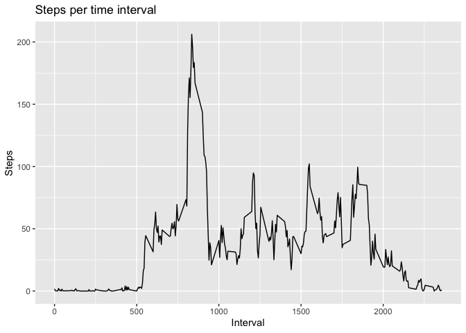
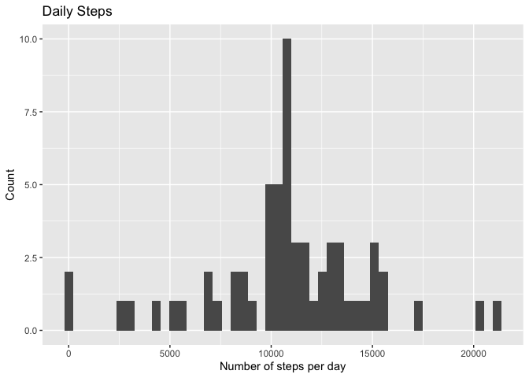
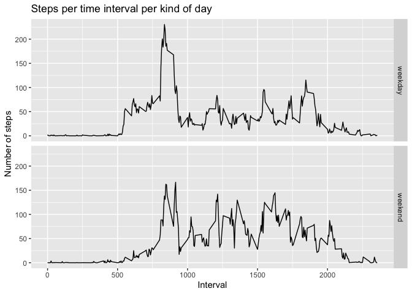

## Reproducible Research Course Project 1
Details can be found [here](https://www.coursera.org/learn/reproducible-research/peer/gYyPt/course-project-1).

## Loading and preprocessing the data
We load the data directly from the zip archive "activity.zip" and transform the "date" column to an appropriate date format.

```r
#use message = FALSE to hide messages from loading the library
library(dplyr)
act <- read.table(unz("activity.zip","activity.csv"), header = TRUE, sep = ",")
act <- transform(act, date = as.Date(date))
```

## What is mean total number of steps taken per day?

```r
#use message = FALSE to hide messages from loading the library
library(ggplot2)
total_steps <- act %>% group_by(date) %>% summarize(steps = sum(steps, na.rm = TRUE))
qplot(steps, data = total_steps, bins = 50, main = "Daily steps", xlab = "Number of steps per day", ylab = "Count")
```

<!-- -->

```r
mean_steps <- mean(total_steps$steps)
median_steps <- median(total_steps$steps)
```

The mean of the total steps per day is 9354.2295082 and the median is 10395.

## What is the average daily activity pattern?


```r
avg_steps <- act %>%  group_by(interval) %>% summarize(steps = mean(steps, na.rm = TRUE))
qplot(interval, steps, data=avg_steps, geom = "line", main = "Steps per time interval", xlab = "Interval", ylab = "Steps")
```

<!-- -->

## Imputing missing values
### Number of missing values

```r
#there are no missing dates or intervals, it suffices to calculate the missing steps
missing_values <- sum(is.na(is.na(act$steps)))
```

The number of rows with missing values is 0.

### Imputation
We impute the missing steps by taking the mean of the respective time interval.

```r
#impute values by taking the mean by interval
imputed_values <- act %>% group_by(interval) %>% summarize(mean = mean(steps, na.rm = TRUE))

#create a copy
act_impute <- data.frame(act)
#fill in the missing steps with the imputed values
for(i in 1:nrow(act_impute)){
    if(is.na(act_impute$steps[i])){
        index <- which(imputed_values$interval == act_impute$interval[i])
        act_impute$steps[i] <- imputed_values$mean[index]
    }
}
```

Next, we take a look at the average daily activity pattern again.


```r
total_steps_imputed <- act_impute %>% group_by(date) %>% summarize(steps = sum(steps))
qplot(steps, data = total_steps_imputed, bins = 50, main = "Daily Steps", xlab = "Number of steps per day", ylab = "Count")
```

<!-- -->

```r
imputed_mean_steps <- mean(total_steps_imputed$steps)
imputed_median_steps <- median(total_steps_imputed$steps)
```

When missing steps are imputed as above, the mean of the total steps per day is 10766.19 and the median is 10766.19. While the mean and median do not change too much, values around the mean become much more prominent after imputation.

## Are there differences in activity patterns between weekdays and weekends?
We add a column indicating wether there respective date is a weekday or not. For this step, we use the imputed values from before.

```r
#transform weekdays to numbers (1 == Monday)
wd <- as.numeric(strftime(act$date, "%u"))

#helper function to turn number of the day into "weekday" and "weekend"
weekday_or_weekend <- function(row){
    if(row < 6){
        return("weekday")
    } else{
        return("weekend")    
    }
}

#create new weekend/weekday column
act_impute$day <- as.factor(sapply(wd, weekday_or_weekend))
```
### Activity patterns of weekdays and weekends

```r
avg_steps_day <- act_impute %>%  group_by(day, interval) %>% summarize(steps = mean(steps, na.rm = TRUE))

g <- qplot(interval, steps, data=avg_steps_day, geom = "line", main = "Steps per time interval per kind of day", xlab = "Interval", ylab = "Number of steps") 
g <- g + facet_grid(rows = day ~ .)
print(g)
```

<!-- -->
